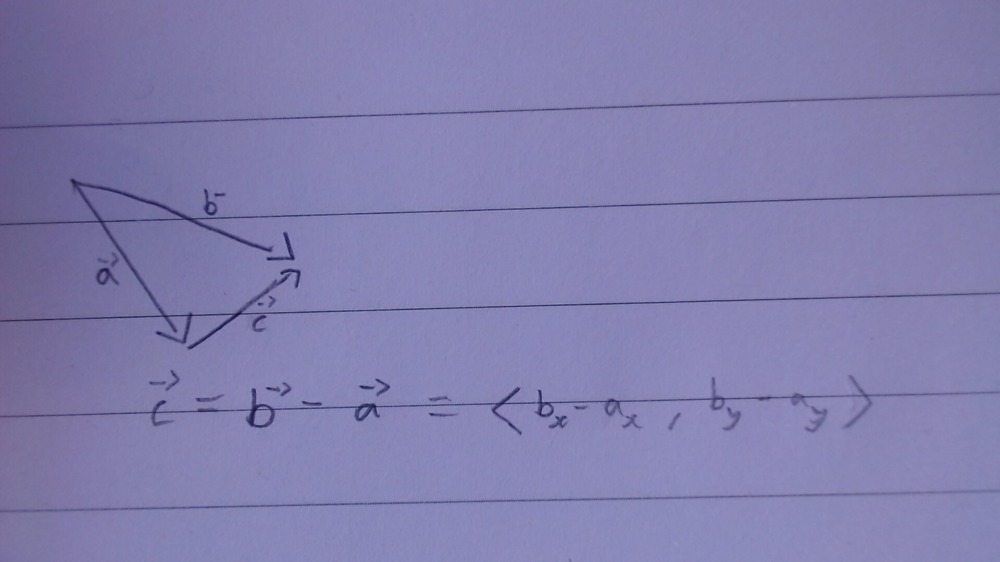

## Hello There!

welcome to this little electron simulator, which was built through pygame.
It's rather straight forward - a circle on the screen which has some little blue dots (electrons) that spin around it.
It also contains a feature that is a little more complex which is that the electrons repel each other!

### Usage:
run it using your program of choice, personally I use 'uv'. I would also recommend that you use it as the pyproject.toml is already in there and it will make it much easier 

So for my case:
```
uv run main.py
```

**There is also an optional flag** -> "--star"
This will draw lines between each of the electrons which makes a very cool star pattern!

## Build Info
This project required quite a hefty amount of maths, more-or-less all of which can be found in electron.py.
The mathematics required include *trigonometry*, *gradients* and most importantly...
**Vectors**

Pygame comes with a built in pygame.Vector2() object which is incredibly useful for finding coordinates and drawing on a plane.



This rule was incredibly useful, it's a way of finding the vector between two vector heads.
In essence, we go back the first vector (vector a in the picture) and then forward the second one (vector b in the picture).
The way to travel multiple vectors is by adding them up, so we add *vector b* with the *inverse of vector a* (which is why we have -a)
